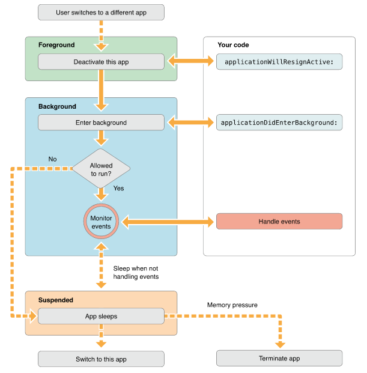
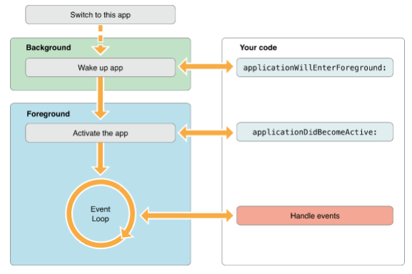
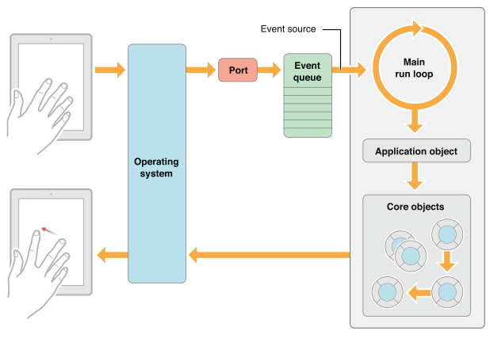

ios学习路线—Objective-C(生命周期)
===
### 视图控制器生命周期

> 当一个视图控制器被创建，并在屏幕上显示的时候。 代码的执行顺序

1. alloc 创建对象，分配空间

2. init(initWithNibName) 初始化对象，初始化数据

3. loadView 从nib载入视图，通常这一步不需要去干涉。除非你没有使用xib文件创建视图

4. viewDidLoad 载入完成，可以进行自定义数据以及动态创建其它控件

5. viewWillAppear 视图将出现在屏幕之前，马上这个视图就会被展现在屏幕上

6. viewDidAppear 视图已在屏幕上渲染完成

> 当一个视图被移除屏幕并且销毁的时候的执行顺序，这个顺序差不多和上面的相反

1. viewWillDisappear 视图将被从屏幕上移除之前执行

2. viewDidDisappear 视图已经从屏幕上移除，用户看不到这个视图了

3. dealloc 视图被销毁，此外需要对你的init和viewDidLoad中创建的对象进行释放

关于viewDidUnload ：在发生内存警告的时候如果本视图不是当前屏幕上正在显示的视图的话， viewDidUnload将会被执行，本视图的所有子视图将被销毁，以释放内存,此时开发者需要手动对viewLoad、viewDidLoad中创建的对象释放内存。 因为当这个视图再次显示在屏幕上的时候，viewLoad、viewDidLoad 再次被调用，以便再次构造视图。

> 当我们创建一个UIViewController类的对象时，通常系统会生成几个默认的方法，这些方法大多与视图的调用有关，但是在视图调用时，这些方法的调用顺序如何，需要整理下。

通常上述方法包括如下几种，这些方法都是UIViewController类的方法：

    (void)viewDidLoad；
    (void)viewDidUnload；
    (void)viewWillAppear:(BOOL)animated；
    (void)viewDidAppear:(BOOL)animated；
    (void)viewWillDisappear:(BOOL)animated；
    (void)viewDidDisappear:(BOOL)animated；

下面介绍下APP在运行时的调用顺序。

   1. \- (void)viewDidLoad；
一个APP在载入时会先通过调用loadView方法或者载入IB中创建的初始界面的方法，将视图载入到内存中。然后会调用viewDidLoad方法来进行进一步的设置。通常，我们对于各种初始数据的载入，初始设定等很多内容，都会在这个方法中实现，所以这个方法是一个很常用，很重要的方法。

  但是要注意，这个方法只会在APP刚开始加载的时候调用一次，以后都不会再调用它了，所以只能用来做初始设置。

   2. \- (void)viewDidUnload;在内存足够的情况下，软件的视图通常会一直保存在内存中，但是如果内存不够，一些没有正在显示的viewcontroller就会收到内存不够的警告，然后就会释放自己拥有的视图，以达到释放内存的目的。但是系统只会释放内存，并不会释放对象的所有权，所以通常我们需要在这里将不需要在内存中保留的对象释放所有权，也就是将其指针置为nil。

   这个方法通常并不会在视图变换的时候被调用，而只会在系统 退出或者收到内存警告的时候才会被调用。但是由于我们需要保证在收到内存警告的时候能够对其作出反应，所以这个方法通常我们都需要去实现。另外，即使在设备上按了Home键之后，系统也不一定会调用这个方法，因为IOS4之后，系统允许将APP在后台挂起，并将其继续滞留在内存中，因此,viewcontroller并不会调用这个方法来清除内存。
   3. \- (void)viewWillAppear:(BOOL)animated;系统在载入所有数据后，将会在屏幕上显示视图，这时会先调用这个方法。通常我们会利用这个方法，对即将显示的视图做进一步的设置。例如，我们可以利用这个方法来设置设备不同方向时该如何显示。
   另外一方面，当APP有多个视图时，在视图间切换时，并不会再次载入viewDidLoad方法，所以如果在调入视图时，需要对数据做更新，就只能在这个方法内实现了。所以这个方法也非常常用。

   4. \- (void)viewDidAppear:(BOOL)animated；有时候，由于一些特殊的原因，我们不能在viewWillApper方法里，对视图进行更新。那么可以重写这个方法，在这里对正在显示的视图进行进一步的设置。

   5. \- (void)viewWillDisappear:(BOOL)animated；在视图变换时，当前视图在即将被移除、或者被覆盖时，会调用这个方法进行一些善后的处理和设置。

   由于在IOS4之后，系统允许将APP在后台挂起，所以在按了Home键之后，系统并不会调用这个方法，因为就这个APP本身而言，APP显示的view，仍是挂起时候的view，所以并不会调用这个方法。
   6. \- (void)viewDidDisappear:(BOOL)animated；我们可以重写这个方法，对已经消失，或者被覆盖，或者已经隐藏了的视图做一些其他操作。

## 应用程序生命周期

> ##### 1.应用程序的状态如下:

* Not running 未运行 程序没启用

* Inactive 未激活 程序在前台运行，不过没有接收到事件。在没有事件处理情况下程序通常停留在这个状态

* Active 激活 程序在前台运行而且接收到了事件。这也是前台的一个正常的模式

* Backgroud 后台 程序在后台而且能执行代码，大多数程序进入这个状态后会在在这个状态上停留一会。时间到之后会进入挂起状态(Suspended)。有的程序经过特殊的请求后可以长期处于Backgroud状态

* Suspended 挂起 程序在后台不能执行代码。系统会自动把程序变成这个状态而且不会发出通知。当挂起时，程序还是停留在内存中的，当系统内存低时，系统就把挂起的程序清除掉，为前台程序提供更多的内存。

下图是程序状态变化图:


各个程序运行状态时代理的回调:

```
//告诉代理进程启动但还没进入状态保存
- (BOOL)application:(UIApplication *)application willFinishLaunchingWithOptions:(NSDictionary *)launchOptions

//告诉代理启动基本完成程序准备开始运行
- (BOOL)application:(UIApplication *)application didFinishLaunchingWithOptions:(NSDictionary *)launchOptions

//当应用程序将要入非活动状态执行，在此期间，应用程序不接收消息或事件，比如来电话了
- (void)applicationWillResignActive:(UIApplication *)application

//当应用程序入活动状态执行，这个刚好跟上面那个方法相反
- (void)applicationDidBecomeActive:(UIApplication *)application

//当程序被推送到后台的时候调用。所以要设置后台继续运行，则在这个函数里面设置即可
- (void)applicationDidEnterBackground:(UIApplication *)application

//当程序从后台将要重新回到前台时候调用，这个刚好跟上面的那个方法相反
- (void)applicationWillEnterForeground:(UIApplication *)application

//当程序将要退出是被调用，通常是用来保存数据和一些退出前的清理工作。这个需要要设置UIApplicationExitsOnSuspend的键值
- (void)applicationWillTerminate:(UIApplication *)application

//当程序载入后执行
- (void)applicationDidFinishLaunching:(UIApplication*)application

```
> ##### 2.应用程序的生命周期

 2.1.加载应用程序进入前台


2.2.加载应用程序进入后台


2.3.关于main函数

main函数是程序启动的入口，在iOS app中，main函数的功能被最小化，它的主要工作都交给了UIKit framework

```
#import <UIKit/UIKit.h>

int main(int argc, char *argv[])
{
    @autoreleasepool {
        return UIApplicationMain(argc, argv, nil, NSStringFromClass([MyAppDelegate class]));
    }
}

```

UIApplicationMain函数有四个参数，你不需要改变这些参数值，不过我们也需要理解这些参数和程序是如何开始的。

argc 和argv参数包含了系统带过来的启动时间。

第三个参数确定了主要应用程序类的名称，这个参数指定为nil，这样UIKit就会使用默认的程序类UIApplication。

第四个参数是程序自定义的代理类名，这个类负责系统和代码之间的交互。它一般在Xcode新建项目时会自动生成。

另外 UIApplicationMain函数加载了程序主界面的文件。虽然这个函数加载了界面文件，但是没有放到应用程序的windows上，你需要在Delegate的 application:willFinishLaunchingWithOptions方法中加载它。
一个应用程序可以有一个主的storyboard文件或者有一个主的nib文件，但不能同时有两个存在。
如果程序在启动时没有自动加载主要的故事版或nib文件，你可以在application:willFinishLaunchingWithOptions方法里准备windows的展示。

> ##### 3.响应中断:
3.1.当一个基于警告式的中断发生时，比如有电话打进来了，这是程序会临时进入inactive状态，这用户可以选择如何处理这个中断，流程如下图：


在iOS5,通知不会把程序变成为激活状态，通知会显示在状态栏上，如果你；拉下状态栏，程序会变成inactive,把状态栏放回去，程序变回active。

按锁屏键也是另外一种程序的中断，当你按下锁屏键，系统屏蔽了所有触摸事件，把app放到了后台，这时app状态是 inactive，并进入后台。

3.2. 当有这些中断时，我们的app该怎么办呢？我们应该在
(1).applicationWillResignActive:方法中：

(2).停止timer 和其他周期性的任务

(3).停止任何正在运行的请求

(4).暂停视频的播放

(5).如果是游戏那就暂停它

(6).减少OpenGL ES的帧率

(7).挂起任何分发的队列和不重要的操作队列（你可以继续处理网络请求或其他时间敏感的后台任务）。
当程序回到active状态 ， applicationDidBecomeActive: 方法应该上面提到的任务重新开始，比如重新开始timer, 继续分发队列，提高OpenGL ES的帧率。不过游戏要回到暂停状态，不能自动开始。

> ##### 4.转到后台运行
4.1如图所示：



PS:只有在IOS4以上系统或者支持多任务的设备才能后台运行。不然会直接结束状态。

4.2 当应用程序进入后台时，我们应该做写什么呢？

(1).保存用户数据或状态信息，所有没写到磁盘的文件或信息，在进入后台时，最后都写到磁盘去，因为程序可能在后台被杀死，

(2).释放尽可能释放的内存

applicationDidEnterBackgound: 方法有大概5秒的时间让你完成这些任务。如果超过时间还有未完成的任务，你的程序就会被终止而且从内存中清除。如果还需要长时间的运行任务，可以调用 beginBackgroundTaskWithExpirationHandler 方法去请求后台运行时间和启动线程来运行长时间运行的任务。

4.3 应用程序在后台时的内存使用

在后台时，每个应用程序都应该释放最大的内存。系统努力的保持更多的应用程序在后台同时 运行。不过当内存不足时，会终止一些挂起的程序来回收内存，那些内存最大的程序首先被终止。
事实上，应用程序应该的对象如果不再使用了，那就应该尽快的去掉强引用，这样编译器可以回收这些内存。如果你想缓存一些对象提升程序的性能，你可以在进入后台时，把这些对象去掉强引用。

下面这样的对象应该尽快的去掉强引用：

(1).图片对象

(2).你可以重新加载的 大的视频或数据文件

(3).任何没用而且可以轻易创建的对象

在后台时，为了减少程序占用的内存，系统会自动在回收一些系统帮助你开辟的内存。比如：

系统回收Core Animation的后备存储。

去掉任何系统引用的缓存图片

去掉系统管理数据缓存强引用

5.返回前台运行

流程如图所示



当app处于挂起状态时，它是不能执行任何代码的。因此它不能处理在挂起期间发过来的通知，比如方向改变，时间改变，设置的改变还有其他影响程序展现的或状态的通知。在程序返回后台或前台是，程序都要正确的处理这些通知。

6.程序的终止

程序只要符合以下情况之一，只要进入后台或挂起状态就会终止：

iOS4.0以前的系统

app是基于iOS4.0之前系统开发的。

设备不支持多任务

在Info.plist文件中，程序包含了UIApplicationExitsOnSuspend 键。

app如果终止了 ,系统会调用app的代理的方法 applicationWillTerminate: 这样可以让你可以做一些清理工作。你可以保存一些数据或app的状态。这个方法也有5秒钟的限制。超时后方法会返回程序从内存中清除。

注意：用户可以手工关闭应用程序。

7.The Main Run Loop主运行循环

Main Run Loop负责处理用户相关的事件。UIApplication对象在程序启动时启动main run Loop，它处理事件和更新视图的界面。看Main Run Loop就知道，它是运行在程序的主线程上的。这样保证了接收到用户相关操作的事件是按顺序处理的。

Main Run Loop 处理事件的架构图：



用户操作设备，相关的操作事件被系统生成并通过UIKit的指定端口分发。事件在内部排成队列，一个个的分发到Main run loop 去做处理。UIApplication对象是第一个接收到时间的对象，它决定事件如何被处理。触摸事件分发到主窗口，窗口再分发到对应出发触摸事件的View。其他的事件通过其他途径分发给其他对象变量做处理。

大部分的事件可以在你的应用里分发，类似于触摸事件，远程操控事件（线控耳机等）都是由app的 responder objects 对象处理的。Responder objects 在你的app里到处都是，比如：UIApplication 对象。view对象，view controller 对象，都是resopnder objects。大部分事件的目标都指定了resopnder object，不过事件也可以传递给其他对象。比如，如果view对象不处理事件，可以传给父类view或者view controller。
